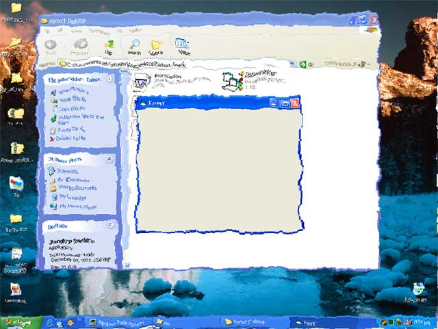

## Raindrop Desktop

### Description

It is a really simple program creating a kinda raindrop effect on the screen using Windows API.
 
### More Info
 

             |
---                |---
**Submitted On**   |2001-12-04 20:15:08
**By**             |[Asim Aziz](https://github.com/Planet-Source-Code/PSCIndex/blob/master/ByAuthor/asim-aziz.md)
**Level**          |Beginner
**User Rating**    |4.2 (83 globes from 20 users)
**Compatibility**  |VB 6\.0
**Category**       |[Graphics](https://github.com/Planet-Source-Code/PSCIndex/blob/master/ByCategory/graphics__1-46.md)
**World**          |[Visual Basic](https://github.com/Planet-Source-Code/PSCIndex/blob/master/ByWorld/visual-basic.md)
**Archive File**   |[Raindrop\_D393781242001\.zip](https://github.com/Planet-Source-Code/asim-aziz-raindrop-desktop__1-29466/archive/master.zip)

### API Declarations

Uses Windows API

